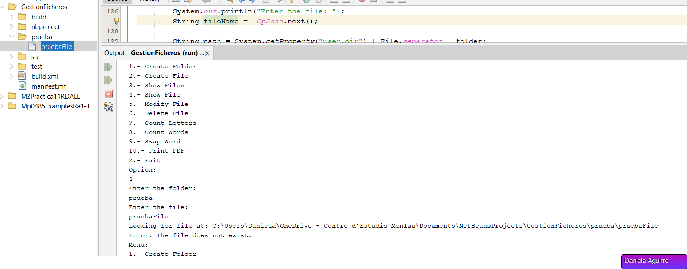

# 📦 Java File Manager Console App

A console-based application built in Java to manage folders and `.txt` files locally. It also allows exporting `.txt` files to PDF using the [OpenPDF](https://github.com/LibrePDF/OpenPDF) library.

---

## ✨ Features

🗂️ Create and view folders  
📄 Create, read, modify, and delete `.txt` files  
🔡 Count letters (excluding spaces) and words  
🔁 Replace words in a file  
📤 Export `.txt` file contents to PDF format

---
## 📸 Preview

Here’s how it looks in the console:



---

## 🧰 Technologies Used

- **Java SE**
- **OpenPDF 2.0.3**
- Build System: **Apache Ant**
- IDE: **NetBeans**

---

## 📂 Project Structure

GestionFicheros/
├── lib/ # External libraries
│ └── openpdf-2.0.3.jar
├── src/
│ ├── model/
│ │ └── Funciones.java # Core logic
│ └── view/
│ └── console/
│ └── Main.java # Interactive menu
├── build/ # Compiled files (generated)
└── README.md


---

## 🚀 How to Run

1. **Make sure Java and NetBeans are installed.**
2. Place `openpdf-2.0.3.jar` inside the `lib/` folder.
3. Open the project in NetBeans or compile/run it using Ant or terminal.

### 🖥️ From terminal:

**Compile:**
```bash
javac -cp lib/openpdf-2.0.3.jar -d build src/model/Funciones.java src/view/console/Main.java
Run:
# Linux/macOS
java -cp build:lib/openpdf-2.0.3.jar view.console.Main

# Windows
java -cp build;lib/openpdf-2.0.3.jar view.console.Main

📸 Example Usage
(assets/example1.png)


👩‍💻 Author
Developed by Ruth Daniela Aguirre
📍 DAM - Centre d'Estudis Monlau
💬 Stay in touch!

📝 License
This project is educational and open for personal or academic use.